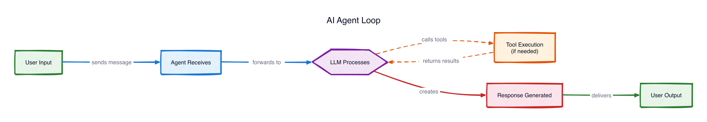

# Module 1: Agent Loop + Tools

Build a customer service agent with Strands Agents that looks up customers, checks orders, and processes refunds — then inspect the agent loop in action.

## What you'll build

A working agent and a look at how the **agent loop** runs: `User → LLM → Tool Call → Tool Result → LLM → Response`.

## Architecture



The agent loop cycles between the LLM and your tools until the model has enough information to answer: the user prompt goes to the LLM, which decides to call a tool, reads the result, and either calls another tool or returns the final response.

## Files

| File | Purpose |
|------|---------|
| `module-01-agent-loop-tools.ipynb` | Walkthrough: define tools, run the agent, inspect the loop |
| `customer_service_tools.py` | Mock tools: `lookup_customer`, `get_order_history`, `process_refund` |
| `requirements.txt` | `strands-agents` |

## How do I run it?

Open `module-01-agent-loop-tools.ipynb` in **VS Code** or **JupyterLab** and run the cells top to bottom.

You need Python 3.10+ and AWS credentials with Bedrock access (Strands uses Bedrock by default).

## Key concept

Tools are plain Python functions decorated with `@tool`. The LLM reads each docstring to decide when to call them — no manual routing required.

```python
from strands import Agent, tool

@tool
def lookup_customer(customer_id: str) -> str:
    """Look up a customer by their ID."""
    ...

agent = Agent(tools=[lookup_customer], system_prompt=SYSTEM_PROMPT)
agent("I'm C-1001. What are my recent orders?")
```

## What's next

The agent has no guardrails yet. **[Module 2: Hooks](../02-hooks/)** adds a rate limiter that caps tool calls with deterministic code.
