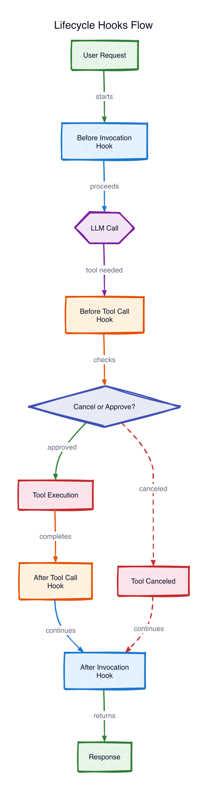

# Module 2: Hooks

Add a rate limiter to the customer service agent. Hooks inject deterministic code into the agent loop — before invocations and around tool calls — without changing the agent's logic.

## What you'll build

A `RateLimiterHook` that caps each tool at N calls per request, so a runaway loop can't call the same tool dozens of times.

## Architecture



Hooks register callbacks on lifecycle events in the agent loop. Here the `RateLimiterHook` intercepts `BeforeToolCallEvent`: it counts calls per tool and blocks the request once a tool exceeds its limit — deterministic control without touching the agent's reasoning.

## Files

| File | Purpose |
|------|---------|
| `module-02-hooks.ipynb` | Walkthrough: build the hook, attach it, trigger the limit |
| `customer_service_tools.py` | Mock tools (shared across modules) |
| `requirements.txt` | `strands-agents` |

## How do I run it?

Open `module-02-hooks.ipynb` in **VS Code** or **JupyterLab** and run the cells top to bottom.

## Key concept

A hook implements `HookProvider` and registers callbacks for lifecycle events such as `BeforeToolCallEvent`. The agent loop calls your code at those points.

```python
from strands.hooks import HookProvider, HookRegistry, BeforeToolCallEvent

class RateLimiterHook(HookProvider):
    """Caps each tool at max_calls per request."""
    ...

agent = Agent(tools=[...], hooks=[RateLimiterHook(max_calls=3)])
```

## What's next

Hooks give low-level control over the loop. **[Module 3: Skills + Steering](../03-skills-steering/)** adds workflow knowledge and business-rule enforcement.
