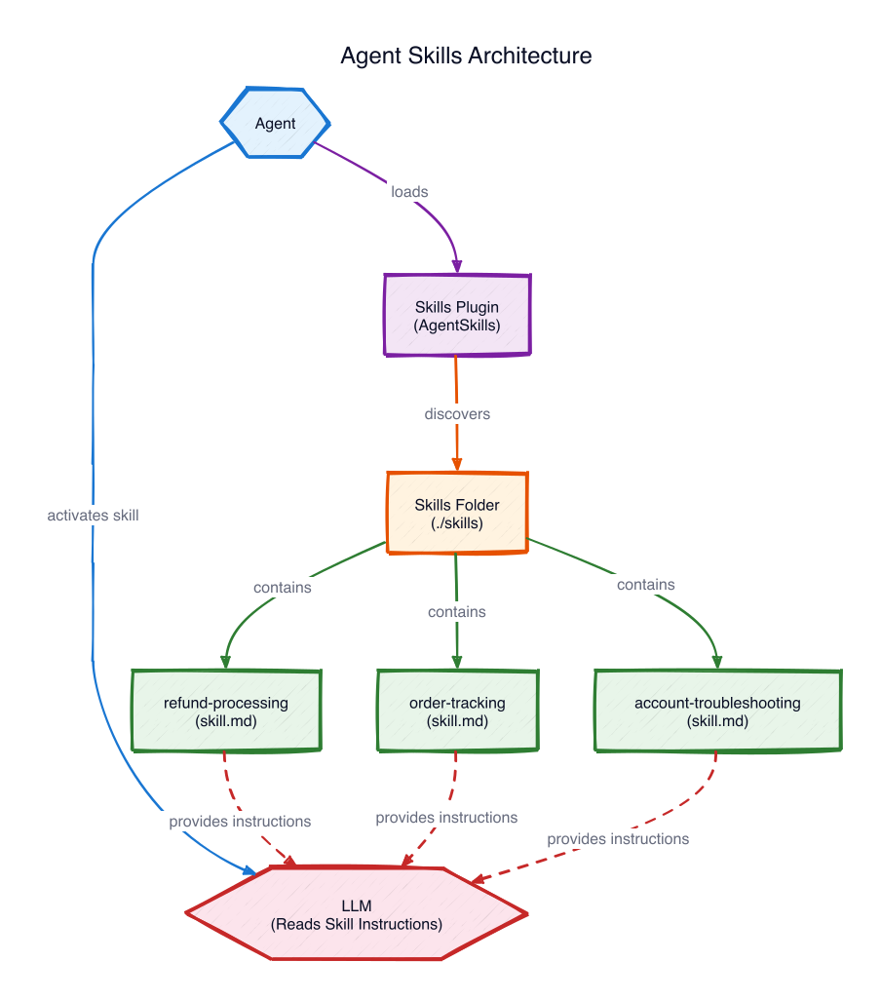
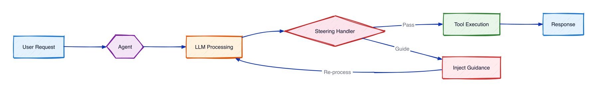

# Module 3: Skills + Steering

Give the agent workflow knowledge with **skills** (markdown procedures it loads on demand) and enforce business rules with **steering handlers** — a deterministic refund-workflow enforcer and an LLM-based tone guardrail.

## What you'll build

- **Skills** — `SKILL.md` files the agent activates for step-by-step procedures.
- **Deterministic steering** — `RefundWorkflowHandler` blocks `process_refund` until `lookup_customer` and `get_order_history` have run.
- **LLM steering** — `ToneGuardrailHandler` evaluates each response for professionalism.

## Architecture

**Skills** are markdown procedures the agent discovers and loads on demand, so it follows the right steps without bloating the system prompt:

**Steering handlers** sit in the loop and enforce rules — the deterministic `RefundWorkflowHandler` blocks refunds until prerequisites run, while the LLM-based `ToneGuardrailHandler` checks each response:

## Files

| File | Purpose |
|------|---------|
| `module-03-skills-steering.ipynb` | Walkthrough: skills, then both steering handlers |
| `steering_handlers.py` | `RefundWorkflowHandler` + `ToneGuardrailHandler` |
| `skills/` | `refund-processing`, `order-tracking`, `account-troubleshooting` |
| `customer_service_tools.py` | Mock tools (shared across modules) |

## How do I run it?

Open `module-03-skills-steering.ipynb` in **VS Code** or **JupyterLab** and run the cells top to bottom.

## Skills vs. steering

| | Skills | Steering handlers |
|--|--------|-------------------|
| Role | Suggest procedures | Enforce rules |
| Format | Markdown (`SKILL.md`) | Python handler |
| Binding | Optional, on demand | Always applied |

## What's next

**[Module 4: Session Managers](../04-session-managers/)** adds persistent memory so the agent remembers conversations across restarts.
