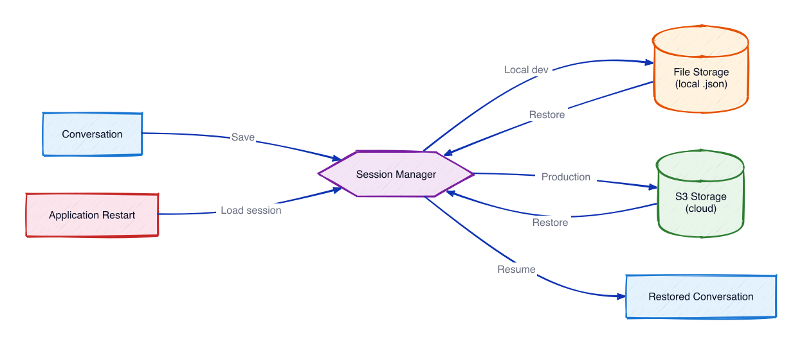

# Module 4: Session Managers

Add file-based persistence to the customer service agent. Stop it, restart it, and watch it remember the previous conversation.

## What you'll build

An agent backed by `FileSessionManager` that saves conversation history to disk and reloads it on restart — so a new agent instance with the same `session_id` keeps its memory.

## Architecture



The session manager persists conversation state outside the agent process. `FileSessionManager` writes local `.json` files for development, while `S3SessionManager` stores state in the cloud for production — either way, recreating the agent with the same `session_id` restores the prior conversation.

## Files

| File | Purpose |
|------|---------|
| `module-04-session-managers.ipynb` | Walkthrough: no-persistence problem → add session manager → restart and remember |
| `steering_handlers.py` | Steering handlers carried over from Module 3 |
| `skills/` | Workflow skills carried over from Module 3 |
| `customer_service_tools.py` | Mock tools (shared across modules) |

## How do I run it?

Open `module-04-session-managers.ipynb` in **VS Code** or **JupyterLab** and run the cells top to bottom. Session files are written to a local `sessions/` folder.

## Key concept

```python
from strands.session.file_session_manager import FileSessionManager

session_manager = FileSessionManager(session_id="customer-session-001", storage_dir="./sessions")
agent = Agent(tools=[...], session_manager=session_manager)
```

Recreate the agent later with the same `session_id` and it reloads the saved messages.

## What's next

**[Module 5: Multi-Agent](../05-multi-agent/)** adds delegation: the agent escalates technical issues to a specialist agent.
