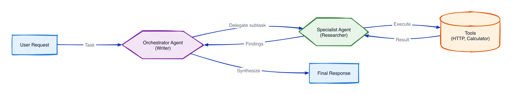

# Module 5: Multi-Agent

Add agent delegation. When the customer service agent hits a technical issue, it escalates to a **tech support specialist** agent using the agents-as-tools pattern.

## What you'll build

An orchestrator agent that calls a focused specialist like a function. The specialist has its own tools and system prompt; the orchestrator decides when to delegate.

## Architecture



With the agents-as-tools pattern, the orchestrator treats a specialist agent as just another tool. It delegates a subtask, the specialist runs its own loop (with its own tools), returns findings, and the orchestrator synthesizes the final response.

## Files

| File | Purpose |
|------|---------|
| `module-05-multi-agent.ipynb` | Walkthrough: build the specialist, wrap it as a tool, let the orchestrator route |
| `customer_service_tools.py` | Mock tools (shared across modules) |

## How do I run it?

Open `module-05-multi-agent.ipynb` in **VS Code** or **JupyterLab** and run the cells top to bottom.

## Key concept

The `@tool` decorator turns a specialist agent into a callable tool for the orchestrator.

```python
@tool
def tech_support_specialist(issue_description: str) -> str:
    """Escalate a technical issue to the tech support specialist agent."""
    specialist = Agent(tools=[...], system_prompt=TECH_PROMPT)
    return str(specialist(issue_description))

orchestrator = Agent(tools=[lookup_customer, get_order_history, process_refund, tech_support_specialist])
```

Order questions stay with the orchestrator; device problems get delegated.

## What's next

**[Module 6: Evals](../06-evals/)** adds automated tests to verify the agent behaves correctly at scale.
