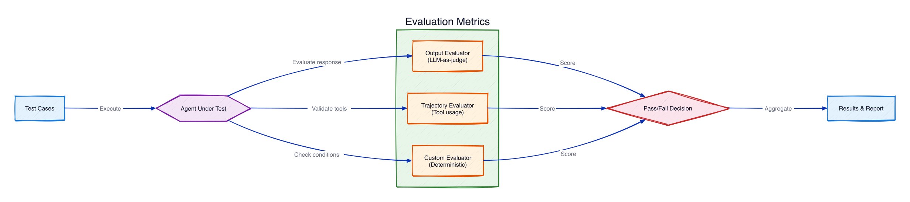

# Module 6: Evals

Run automated evaluations against the customer service agent: an **output eval** (is the response good?) and a **trajectory eval** (did it follow the right workflow?).

## What you'll build

- **Output evaluation** — `OutputEvaluator` uses LLM-as-a-judge to score responses against expected output.
- **Trajectory evaluation** — `TrajectoryEvaluator` checks the agent called tools in the correct order, validating your steering handlers.

## Architecture

Test cases run against the agent, then evaluators score the results: the `OutputEvaluator` judges response quality (LLM-as-a-judge), the `TrajectoryEvaluator` validates tool-usage order, and custom evaluators check deterministic conditions. Scores aggregate into a pass/fail report.

## Files

| File | Purpose |
|------|---------|
| `module-06-evals.ipynb` | Walkthrough: output eval, then trajectory eval |
| `customer_service_tools.py` | Mock tools (shared across modules) |
| `requirements.txt` | Adds `strands-agents-evals` |

## How do I run it?

Open `module-06-evals.ipynb` in **VS Code** or **JupyterLab** and run the cells top to bottom.

## Output vs. trajectory

| Eval | Question it answers | Evaluator |
|------|---------------------|-----------|
| Output | Is the final response correct and helpful? | `OutputEvaluator` |
| Trajectory | Did the agent call the right tools in order? | `TrajectoryEvaluator` |

## What's next

The agent is validated. **[Module 7: Deploy](../07-deploy/)** packages it as a production service on Bedrock AgentCore Runtime.
