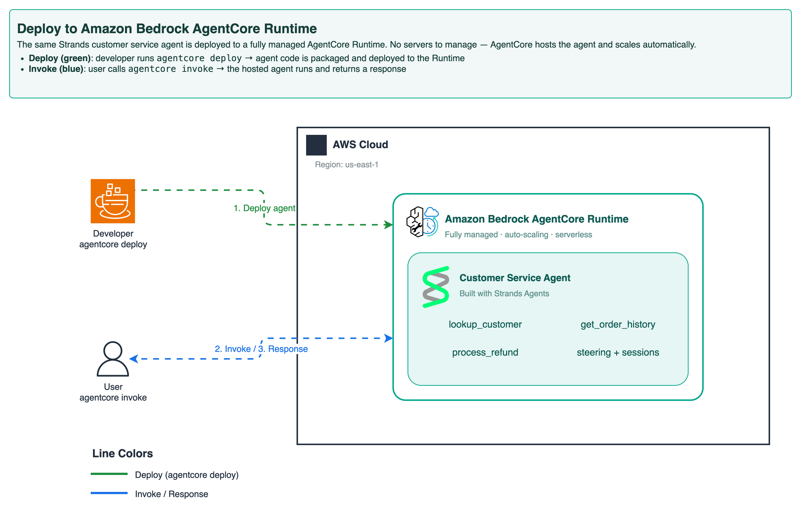

# Module 7: Deploy to AgentCore Runtime

Package the customer service agent as a service and deploy it to **Bedrock AgentCore Runtime**, then invoke it from the CLI.

> AgentCore (Amazon Bedrock AgentCore) is a managed runtime for hosting agents. See the [AgentCore docs](https://docs.aws.amazon.com/bedrock-agentcore/latest/devguide/?trk=87c4c426-cddf-4799-a299-273337552ad8&sc_channel=el).

## What you'll build

A deployable agent wrapped in `BedrockAgentCoreApp` with an `@app.entrypoint`, ready for `agentcore deploy` and `agentcore invoke`.

## Architecture



`agentcore deploy` packages your agent code and uploads it to an Amazon S3 staging bucket (the default `direct_code_deploy` build), then provisions the AgentCore Runtime via AWS CloudFormation. At invocation, an IAM execution role grants the runtime access to Amazon Bedrock for inference, the agent runs its tools, and Amazon CloudWatch captures logs and traces — all with no servers to manage.

## Files

| File | Purpose |
|------|---------|
| `module-07-deploy.ipynb` | Walkthrough: configure, deploy, and invoke |
| `main.py` | Deployable entrypoint (`BedrockAgentCoreApp` + agent) |
| `steering_handlers.py` | Steering handlers from Module 3 |
| `skills/` | Workflow skills from Module 3 |
| `customer_service_tools.py` | Mock tools (shared across modules) |
| `requirements.txt` | Adds `bedrock-agentcore` |

## How do I deploy it?

Open `module-07-deploy.ipynb` in **VS Code** or **JupyterLab** for the full walkthrough, then run from this folder:

```bash
agentcore configure -e main.py    # prepare deployment (generates .bedrock_agentcore.yaml)
agentcore deploy                  # package code to S3 and create the runtime via CloudFormation
agentcore invoke '{"prompt": "I am customer C-1001. What are my recent orders?"}'
```

You need AWS credentials with AgentCore access and the `agentcore` CLI (from `bedrock-agentcore-starter-toolkit`). The default `direct_code_deploy` build runs in the cloud — no Docker required.

## Test locally first

`main.py` runs standalone with `python main.py` (it calls `app.run()`), so you can verify the agent before deploying.

## What's next

This completes Workshop 1. **[Workshop 2](../../workshop-2-production-operations/)** takes the agent to production with managed Gateway tools, memory, and observability.
